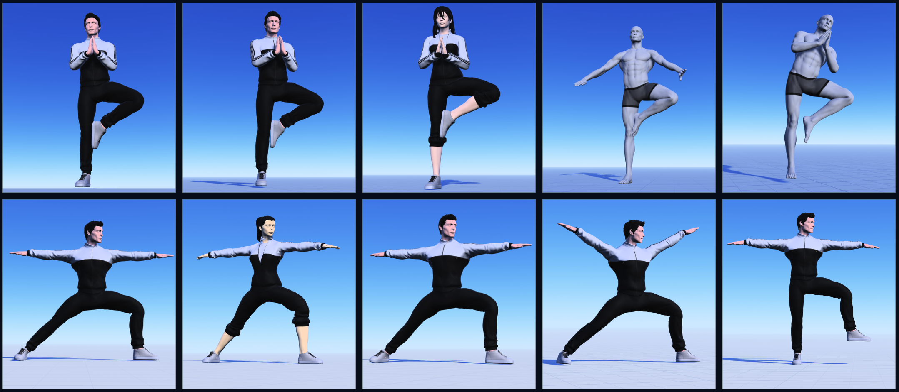
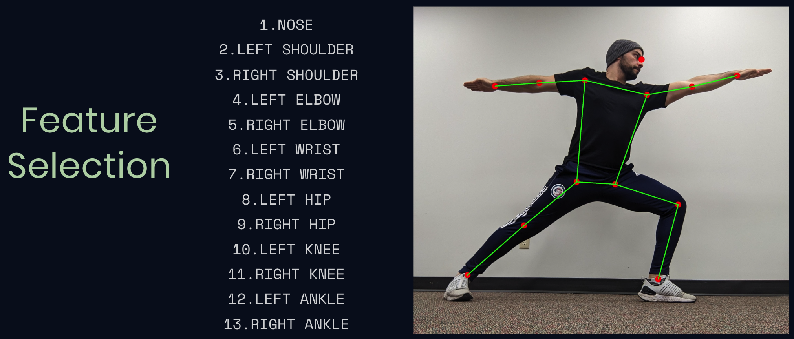

# Pose Classification Project

This project focuses on training a machine learning model to classify yoga poses, specifically the "Tree Pose" and the "Warrior Pose," as either correct or incorrect based on body landmarks data obtained using BlazePose. The project involves data collection, model development, and evaluation.

## Table of Contents

- [Introduction](#introduction)
- [Dataset](#dataset)
- [Data Preparation](#data-preparation)
- [Model Architecture](#model-architecture)
- [Usage](#usage)
- [Repository Structure](#repository-structure)
- [License](#license)

## Introduction

The project aims to classify the "Tree Pose" and "Warrior Pose" based on body landmarks data. Detailed information about the project's background, objectives, and methods can be found in the project's Jupyter Notebooks.

## Dataset

- The dataset contains body landmarks data collected using BlazePose during the execution of the "Tree Pose" and "Warrior Pose."
- The dataset is used for training, validation, and testing.
  <!-- width="300" -->

### Feature Selection

- Feature selection was performed to identify key body landmarks for pose classification.
- The selected features are visualized in the image below.
  <!-- width="300" -->

## Data Preparation

The repository includes a Python script, `pose_detection.py`, that uses the BlazePose model to detect and record body landmarks in images. The script processes images, extracts landmark data, and saves the results in a CSV file.

### Running the Pose Detection Script

To run the pose detection script, follow these steps:

1. Ensure you have all the necessary dependencies installed. You can install them using: ```pip install -r requirements.txt ```
2. Organize your image data in the following structure:
   ```
   Pose
   └── Images
       ├── train
       │   ├── good
       │   └── bad
       └── test
           ├── good
           └── bad
   ```
3. Run the script with the following command:
   ``` python pose_detection.py /path/to/Images ```
   
5. Optional arguments:
   ```
    -o, --output: Specify the name of the CSV file to output.
    -p, --pixels: Store the data in pixels.
    -l, --logs: Print debug logs as it's processing.
    -t, --test-data: Select the test directory instead of train.
    -d, --debug: Show the landmark on output images.
   ```

## Model Architecture

- The project involves the development of a neural network model for pose classification.
- The model architecture includes an input layer, embedding layer, dense layers, and an output layer. Details can be found in the Jupyter Notebooks.


## Usage

- The Jupyter Notebooks (`tree.ipynb` and `warrior.ipynb`) provide code and documentation for data preprocessing, model development, training, and evaluation.
- The Pose Detection Script (`pose_detection.py`) can be used to preprocess image data for training.

## Repository Structure

The repository is organized as follows:

- `notebooks/`: Contains Jupyter Notebooks with code and documentation.
- `models/`: Stores the trained model files in TensorFlow and TensorFlow Lite formats.
- `Dataset/`: CSV Dataset files for both poses.
- `pose_detection.py`: Python script for pose detection using BlazePose.
- `requirements.txt`: Requirements for preparing the dataset.
- `README.md`: This file.

## License

This project is licensed under the [MIT License](LICENSE). Feel free to use, modify, and distribute it as needed.
